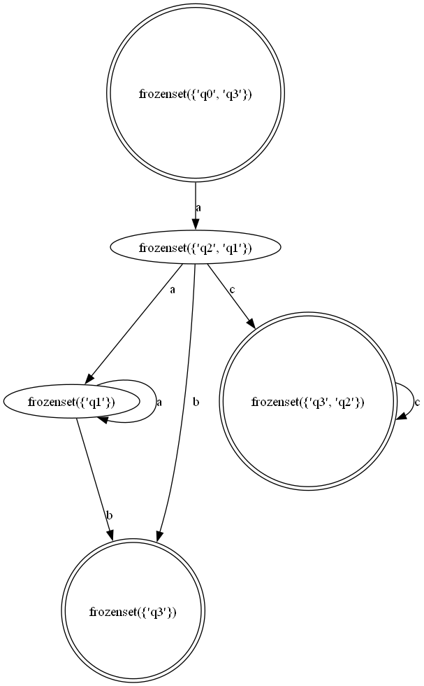

# Non-deterministic Inite Automata Converter

根据NFA/ENFA, 构造对应的 DFA, 最后使用 [dot](http://graphviz.org) 语法绘制出 DFA. 

使用姿势如下:

```
$ ./main.py --arguements

根据 NFA/ENFA 生成其对应 DFA 的状态转移图

optional arguments:
  --file-path,   输入的NF/ENFA的状态表(用 $ 表示 \eplision)
  --output-path, 输出的图片以及文件的保存地址
  --mode,        选择 NFA-->DFA 或者 ENFA-->DFA
  --plot         是否使用 graphviz 绘画图片
```


```
$ ./main.py  --mode nfa --file-path ./inputs/example1.txt
```


```
$ ./main.py  --mode enfa --file-path ./inputs/example5.txt
```



